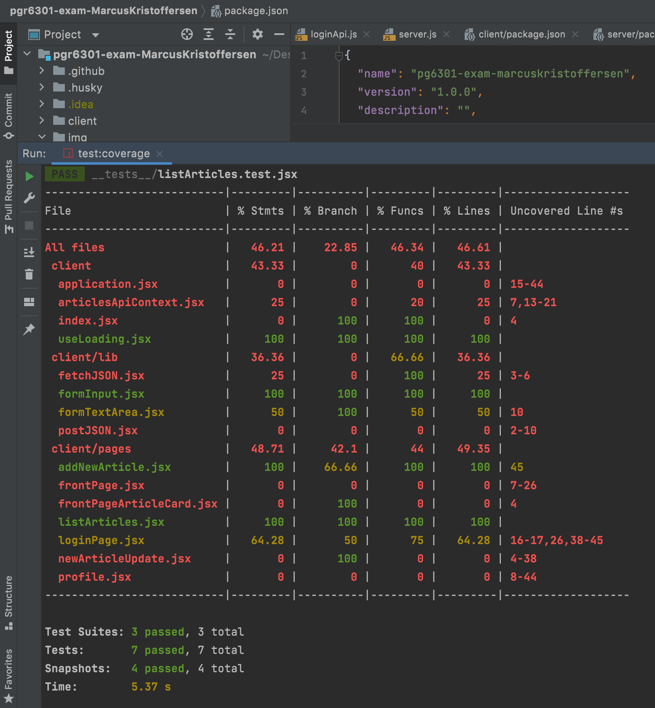
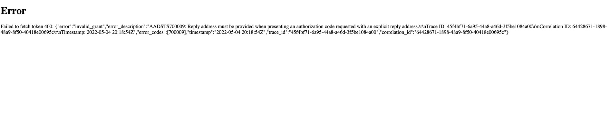
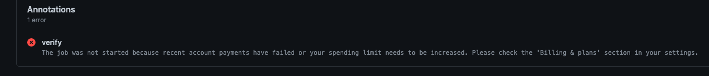

# PG6301 eksamen <NewsPageByMarcus>

[Heroku]( https://newspagebymarcus.herokuapp.com/ )
[Test rapport](https://github.com/kristiania-pg6301-2022/pgr6301-exam-MarcusKristoffersen/actions)

Linker til github actions, i stedet for coverage (Forklaring nedenfor)

Test coverage lokalt:

## Mangler av funksjonelle krav
Feilhåndteringer på denne siden er minimal. Eneste siden man må være innlogget for å komme seg til er /profile.
Om man prøver å søke på http://localhost:3000/profile eller https://newspagebymarcus.herokuapp.com/profile
uten å være innlogget kommer det ingen feilhåndtering og siden blir hvit, noe som naturligvis er feil.

Detaljene på èn spesifikk artikkel kan ikke bli trykket på, men det går i stedet an å se alle artiklene på en gang. 

Nedtrekksliste på denne løsningen er fraværende
Tester for server er fraværende

Det er ikke mulighet for å logge inn via Active Directory, 
men dette ble forsøkt lenge med const discovery_endpoint = "https://login.microsoftonline.com/organizations/v2.0/.well-known/openid-configuration";
Jeg lagde også en egen funksjon med navn microsoftConfig, for å skille google logg inn og microsoft logg inn. 
Jeg koblet også opp portal azure mot klient id'en: MICROSOFT_CLIENT_ID=aedc5c76-9148-4e1d-8c4e-20ae08e0def2
Tilbakemeldingen jeg fikk var som følger:

"Brukeren skal forhindres fra å sende inn en nyhetsartikkel som mangler kategori, tittel eller tekst":
 Byttet ut kategori med article text, for kategori hadde ikke hatt noe relevant funksjon på min side
Brukeren må skrive inn title, topic og article med koden:
<button
disabled={
title.length === 0 || topic.length === 0 || articletext.length === 0
}
>

http://localhost:3000/articles/update eller https://newspagebymarcus.herokuapp.com/articles/update 
Som da er live nyheter siden, har hardkodet strings som blir sendt fra server til client. 
Tok dette med for å vise mine kunnskaper innenfor sockets, og er klar over at dette ikke er en fullverdig funksjon.
Ulempen med dette er at coverage prosenten blir lavere, grunnet mangel på tester for articlesApiContext

Min siste push til github kræsjet på grunn av at github kræsjet:

